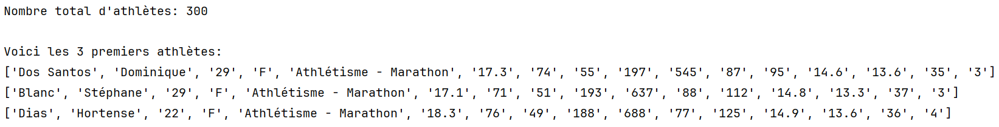
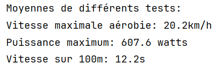

# Travail Pratique 4 — Analyse d'un jeu de données

## Objectifs pédagogiques

Ce TP vise à consolider les apprentissages du cours :

- Comprendre et appliquer les listes
- Comprendre et appliquer les tuples
- Comprendre et appliquer les dictionnaires
- Comprendre et appliquer l’extraction des données à partir d’un fichier
- Utiliser des fonctions de Matplotlib
- Récupération des données et préparation des graphiques

---

## Pondération

Ce travail compte pour **20 % de la note finale**.

---

## Évaluation

Voici la pondération des sections :

| Critères                                                                        | Points  |
|---------------------------------------------------------------------------------|---------|
| **Partie 1 - Lecture et exploration des données**                               | 17      |
| Q01                                                                             | 8       |
| Q02                                                                             | 3       |
| Q03                                                                             | 3       |
| Q04                                                                             | 3       |
| **Partie 2 - Analyse et détection d’étoiles**                                   | 43      |
| Q05                                                                             | 4       |
| Q06                                                                             | 4       |
| Q07                                                                             | 5       |
| Q08                                                                             | 5       |
| Q09                                                                             | 5       |
| Q10                                                                             | 5       |
| Q11                                                                             | 5       |
| Q12                                                                             | 5       |
| Q13                                                                             | 5       |
| **Partie 3 - Représentation graphique des données**                             | 40      |
| Q14                                                                             | 10      |
| Q15                                                                             | 10      |
| Q16                                                                             | 10      |
| Q17                                                                             | 10      |
| **Pénalités :** Manque de commentaires pertinents                               | -6      |
| **Pénalités :** Structure, clarté du code déficiente, non-respect des fonctions | -10     |
| **Total**                                                                       | **100** |

---

## Travail en équipe

- Le travail doit être réalisé en équipe de **2 ou 3 personnes**.  
- **Aucun travail individuel ne sera corrigé**. Un travail solo recevra automatiquement la note de **0**.

---

## Remise

- Le projet doit être remis via **GitHub Classroom**.  
- Les remises par **LÉA ne sont pas acceptées**.  
- La date limite sera indiquée sur LÉA **et** dans votre dépôt GitHub Classroom.  
- Vous pouvez faire des **remises partielles** au fil de votre progression grâce à Git.

---

## Prérequis

- Cloner le répertoire GitHub Classroom dans PyCharm (voir le document Git sur LÉA au besoin)  
- Votre code doit être dans le fichier `sportifs.py` fourni dans votre dépôt GitHub Classroom  
- Inscrire le nom des membres de l'équipe, leur numéro de DA et leur nom d'utilisateur GitHub dans l'espace prévu à cet effet dans le fichier `sportifs.py`

---

## Contexte

Vous disposez d’un fichier nommé sportifs_data_enrichi.csv contenant les résultats d’évaluations physiques et physiologiques de 300 sportifs suivis à l’Institut National du Sport (INS). 
Les noms et les données de ce fichier sont fictifs.
Chaque ligne du fichier correspond aux résultats d’un sportif, avec les colonnes suivantes :

ID, Nom, Prénom, Âge, Sexe, Discipline, VMA, VO2max, FC_REPOS, FC_MAX, PUISSANCE_MAX, AGILITE, FORCE_MUSCULAIRE, ENDURANCE, VITESSE_100M, RECUPERATION_1MIN, NIVEAU_STRESS

**Signification des paramètres**

| Variable          | Description                                                                 |
|-------------------|-----------------------------------------------------------------------------|
| ID                | Identifiant unique de l’athlète                                             |
| Nom               | Nom de famille de l’athlète                                                 |
| Prénom            | Prénom de l’athlète                                                         |
| Âge               | Âge en années                                                               |
| Sexe              | Sexe biologique (M/F)                                                       |
| Discipline        | Sport ou activité pratiquée (athlétisme, cyclisme, natation, etc.)          |
| VMA               | Vitesse Maximale Aérobie (km/h)                                             |
| VO2max            | Consommation maximale d’oxygène (ml/min/kg)                                 |
| FC_REPOS          | Fréquence cardiaque au repos (bpm)                                          |
| FC_MAX            | Fréquence cardiaque maximale (bpm)                                          |
| PUISSANCE_MAX     | Puissance maximale atteinte (watts)                                         |
| AGILITE           | Score d’agilité (échelle de 1 à 10)                                         |
| FORCE_MUSCULAIRE  | Score de force musculaire (échelle de 1 à 10)                               |
| ENDURANCE         | Score d’endurance générale (échelle de 1 à 10)                              |
| VITESSE_100M      | Temps réalisé sur 100 mètres (secondes)                                     |
| RECUPERATION_1MIN | Fréquence cardiaque après 1 minute de récupération (bpm)                    |
| NIVEAU_STRESS     | Niveau de stress estimé (Faible, Moyen, Élevé)                              |

---

## Travail à faire

### PARTIE 1 – Lecture et exploration des bilans

L’objectif de cette partie est de lire le fichier, comprendre sa structure, et faire quelques
observations simples.

**Q01 :** Créer une fonction nommée charger_donnees(nom_fichier). Cette fonction prend en paramètre le
**nom d’un fichier** contenant les données des athlètes et retourne une **liste** formée des données
des athlètes (bilans) et une **liste** (entetes) contenant les informations de l’entête. Ces deux listes **ne doivent pas** contenir le premier élément (sans ID).
Il est de votre responsabilité de définir la bonne structure (liste, dictionnaire ou autre, mais pas de
DataFrame pandas) pour bilans adaptés pour stocker les données des athlètes.

|   | sportifs.py                      |
|---|----------------------------------|
| 1 | def charger_donnees(nom_fichier) |
| 2 | # à compléter                    |
| 3 |                                  |
| 4 | return bilans, entetes           |

*Faite appel à la fonction **charger_donnees** pour répondre aux questions suivantes :*

**Q02.** Afficher le nombre total d'athlètes.

**Q03.** Afficher les 3 premiers bilans (lignes) du fichier pour avoir un aperçu du contenu.

Votre affichage de la question Q02 et Q03 doit ressembler à ceci.

**Q04.** Calculer et afficher la moyenne des taux de : vitesse maximale aérobie, puissance maximale atteinte et le temps réalisé sur 100m. Prenez soin de bien arrondir vos données. Votre
affichage doit ressembler à ceci.

---

### PARTIE 2 – Analyse et détection des athlètes hors normes

L’objectif de cette partie est de détecter les athlètes ayant des valeurs hors normes dans leur bilan sportif à l’aide de seuils de performance.
Toute valeur en dehors de ces seuils est considérée comme anormale.

Seuils de référence (athlètes « normaux »)
- VMA (km/h) : 16.0 – 22.0
- VO2max (ml/min/kg) : 55 – 85
- FC_REPOS (bpm) : 40 – 70
- FC_MAX (bpm) : ≤ 200
- NIVEAU_STRESS (score) : ≤ 4.0

On vous demande en premier de créer 5 constantes VMA, VO2MAX, FC_REPOS, FC_MAX et NIVEAU_STRESS.
Chacune des constantes est sous forme de tuple dont la première valeur
consiste la valeur minimale et la deuxième valeur est la valeur maximale. FC_MAX et
NIVEAU_STRESS n’ont pas de valeur minimale. Dans ce cas, mettez la valeur minimale à *None*.

Q05. Créer une fonction est_valide(valeur, seuil) qui prend en paramètre une valeur et seuil sous
forme de tuple puis retourne True ou False selon si l’athlète présente une anomalie ou non.

Q06. Créer une fonction anomalies(bilan) qui prend en paramètre les informations d’un athlète
(bilan) et qui retourne sous forme de liste les paramètres anormaux de cet athlète.
Tout en exploitant les données, il est possible de créer des listes au besoin pour faciliter les calculs.

Répondez aux questions suivantes. Vous pouvez tout faire en une seule boucle.

Q07. Afficher le nombre d’athlètes ayant au moins une anomalie

Q08. Combien d’athlètes ont une VMA hors seuil ?

Q09. Combien d’athlètes ont un VO2max trop faible ?

Q10. Lister les prénoms et noms des athlètes ayant une VMA et un NIVEAU_STRESS élevés

Q11. Afficher le nombre de femmes et d’hommes dans l’échantillon

Q12. Quel est l’âge moyen des athlètes ayant une VMA élevée ?

Q13. Quelle est la proportion de femmes parmi les athlètes ayant un NIVEAU_STRESS élevé ?

Voici un aperçu du résultat attendu dont il faut respecter l’affichage

---

### PARTIE 3 – Représentation graphique des données

L’objectif de cette partie est d’explorer visuellement les résultats à l’aide de courbes et
histogrammes ; vous n’avez le droit d'utiliser que le module matplotlib.

Q14. Écrire une fonction histogramme_repartition_age(bilans) qui prend en paramètre les
données des sportifs (bilans) puis crée un histogramme de la répartition des sportifs par tranches
d’âge (18–20, 21–23, etc.). Voici un aperçu de la courbe dont vous devez respecter l'affichage (titre, axe des X,
des Y, etc)

Q15. Écrire une fonction courbe_vma_hors_norme_par_tranche(bilans) qui prend en paramètre les
données des sportifs (bilans) puis crée puis trace une courbe qui montre le nombre de sportifs
avec une VMA hors normes par tranche d’âge. Vous devez respecter les mêmes informations sur la courbe

Q16. Écrire une fonction courbe_agilite_elevee(bilans), pour tracer une courbe montrant le
nombre de sportifs par âge ayant un score d'agilité supérieur à 85. Les
mêmes informations de la courbe (titre, axes, etc.) doivent être respectés.

Q17. On veut comparer entre les niveaux de stress entre les hommes et les femmes par tranche d’âge. Créer une fonction
histogramme_niveau_stress_par_tranche(bilans) qui permet de réaliser cette comparaison. Votre
graphique doit ressembler à celui-ci.