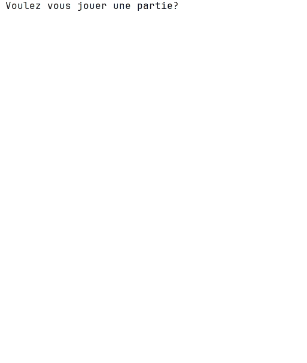

# Travail Pratique 3 — Jeu du Morpion

## Objectifs pédagogiques

Ce TP vise à consolider les apprentissages des chapitres 2 à 10 à travers la création d’un jeu interactif. Vous devrez :

- Utiliser des fonctions importées (chapitre 2)  
- Créer et structurer des sous-programmes (chapitre 3)  
- Maîtriser les structures de contrôle (chapitres 4 à 7)  
- Manipuler des listes efficacement (chapitres 8 à 10)

---

## Pondération

Ce travail compte pour **15 % de la note finale**.

---

## Évaluation

Voici la pondération des sections :
- Partie 1 -> 5 
- Partie 2 -> 5
- Partie 3 -> 10
- Partie 4 -> 10

Voici les critères d'évaluations :
- Respect des consignes  
- Exactitude des calculs et des résultats  
- Qualité du code : noms de variables clairs, commentaires pertinents, structure modulaire

---

## Travail en équipe

- Le travail doit être réalisé en équipe de **2 ou 3 personnes**.  
- **Aucun travail individuel ne sera corrigé**. Un travail solo recevra automatiquement la note de **0**.

---

## Remise

- Le projet doit être remis via **GitHub Classroom**.  
- Les remises par **LÉA ne sont pas acceptées**.  
- La date limite sera indiquée sur LÉA **et** dans votre dépôt GitHub Classroom.  
- Vous pouvez faire des **remises partielles** au fil de votre progression grâce à Git.

---

## Contexte

Vous êtes mandatés pour développer une version console du célèbre jeu **Morpion (Tic-Tac-Toe)**. 
Le jeu se joue à deux joueurs, chacun prenant tour à tour une case dans une grille 3x3. 
Le premier à aligner trois symboles identiques (horizontalement, verticalement ou en diagonale) remporte la partie. 
En cas de grille pleine sans gagnant, la partie est déclarée nulle.

Voici une démonstration du programme attendu :



---

## Prérequis

- Cloner le répertoire GitHub Classroom dans PyCharm (voir le document Git sur LÉA au besoin)  
- Votre code doit être dans le fichier `tictactoe.py` fourni dans votre dépôt GitHub Classroom  
- Inscrire le nom des membres de l'équipe, leur numéro de DA et leur nom d'utilisateur GitHub dans l'espace prévu à cet effet dans le fichier `tictactoe.py`

---

## Travail à faire

### TODO 1 — Faire une partie de morpion

Implémenter la fonction permettant de jouer une partie de morpion.

**Critères à respecter :**

- Nom de la fonction : `faire_une_partie`  
- Paramètres : aucun  
- Valeur de retour : un dictionnaire contenant :
  - `Tour` : le nombre de tours joués
  - `Joueur` : le joueur ayant gagné (`"X"`, `"O"` ou `"Nul"`)

Vous devez :
- Initialiser la grille afin qu'elle contienne les valeurs 1 à 9 en utilisant **une liste en compréhension**. (TODO 1a)
- Demander au joueur d'entrer une cellule entre 1 et 9. (TODO 1b)
- Assigner à la variable `cellule` l'index de la liste contenant la grille de la cellule choisit par le joueur. (TODO 1b)
- Retourner un dictionnaire contenant une première clé (key) nommée Tour et une seconde clé (key) nommée Joueur, ainsi que les valeurs correspondantes (value) 

---

### TODO 2 — Vérifier si la cellule saisie est valide

Implémenter la fonction qui permet de vérifier si la valeur saisie par l'utilisateur est valide.

**Critères à respecter :**

- Nom de la fonction : `cellule_valide`  
- Paramètres :
  - `grille` : un tableau contenant les valeurs de la grille
  - `cellule` : le numéro de cellule choisi par le joueur (0 à 8)
- Valeur de retour : `True` si la cellule est valide, `False` sinon

La fonction doit vérifier :
- que la cellule est comprise entre 0 et 8  
- que la cellule ne contient ni `'X'` ni `'O'`

---

### TODO 3 — Vérifier si un joueur remporte la partie

Implémenter la fonction qui permet de déterminer si un joueur a remporté la partie.

**Critères à respecter :**

- Nom de la fonction : `verifier_victoire`  
- Paramètres :
  - `grille` : un tableau contenant les valeurs de la grille
  - `joueur` : le joueur venant de jouer (`'X'` ou `'O'`)
- Valeur de retour : `True` si le joueur a gagné, `False` sinon

La fonction doit contenir les variables suivantes :

- `ligne1`, `ligne2`, `ligne3` : une liste contenant les 3 données d'une ligne  
- `colonne1`, `colonne2`, `colonne3` : une liste contenant les 3 données d'une colonne  
- `diagonale1`, `diagonale2` : une liste contenant les 3 données d'une diagonale  
- `cas_victoire` : une liste contenant tous les cas possibles de victoire

Vous devez vérifier dans tous les cas si le joueur est présent dans les 3 cellules. Si oui, retourner `True`. Sinon, retourner `False`.

---

### TODO 4 — Créer le programme pour jouer plusieurs fois

Implémenter la fonction permettant de jouer plusieurs parties d'affilée et d'obtenir des statistiques.

**Étapes à suivre :**

1. Initialiser les variables `tours` et `joueurs` comme deux listes vides  
2. Ouvrir le fichier `statistiques.txt` en mode lecture (`"r"`)  
3. Pour chaque ligne du fichier :
   - ajouter à la fin de `tours` la première sous-chaîne avant la virgule. N'oubliez pas de la convertir en int. 
   - ajouter à la fin de `joueurs` la deuxième sous-chaîne après la virgule
5. Créer une boucle infinie qui :
   - demande au joueur s'il veut commencer une nouvelle partie. Les entrées valides sont oui ou non.
   - démarre une partie et enregistre le résultat  
   - ajoute le résultat dans les listes `tours` et `joueurs`  
   - ouvre le fichier `statistiques.txt` en mode écriture (`"w"`)  
   - écrit dans le fichier : nombre de tours, virgule, joueur et si nous ne sommes pas à la dernière ligne un saut de ligne  
   - affiche les statistiques :
     - nombre de tours minimum  
     - nombre de tours maximum  
     - moyenne des tours  
     - nombre de victoires du joueur X  
     - nombre de victoires du joueur O  
     - nombre de matchs nuls

**La méthode `split()`**

La méthode split() est une fonction intégrée aux objets de type str (chaîne de caractères) en Python. 
Elle permet de diviser une chaîne en plusieurs morceaux selon un séparateur donné, et retourne une liste contenant les sous-chaînes.

**Exemple :**

```python
ma_chaine = "Melody/Sophie/Jules/Alex"
print(ma_chaine.split("/"))
```

Affichage: ['Melody', 'Sophie', 'Jules', 'Alex']

